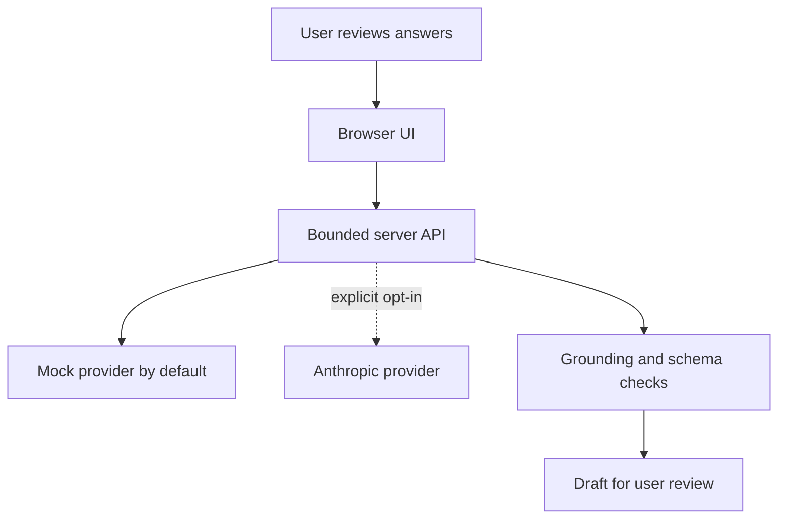

# Doorknob

> Say the important thing first—not at the door on your way out.

Doorknob is an early, UK-oriented appointment-preparation prototype. It asks a
person a short series of plain-English questions, lets them review their own
answers, and organises those answers into a draft brief for a medical
appointment.

> [!WARNING]
> Doorknob is not a medical device, symptom checker, triage service, diagnostic
> system, or substitute for a healthcare professional. It cannot determine
> whether it is safe to wait. Call 999 for a life-threatening emergency; use NHS
> 111 when you need urgent medical help but are not sure what to do.

## What this release establishes

- The browser never receives a model-provider API key.
- Mock mode is the default and makes no external model calls.
- A real Anthropic connection is an explicit server-side operator choice.
- Every answer is reviewed by the user before a draft is requested.
- The person's named worry is copied from their reviewed answer, not generated.
- Suggested verbatim quotations are retained only when they occur in the
  reviewed transcript.
- Inputs and model outputs are length- and schema-bounded.
- No database, analytics package, or external webfont request ships here.

## What it does not establish

- That a model can recognise an emergency reliably.
- That an interview is complete or clinically useful.
- That a generated summary preserves every medically relevant detail.
- That a clinician has reviewed the questions, prompts, or output.
- Compliance, clinical validation, accessibility certification, or fitness for
  real-world care.

Model-generated urgent warnings are defence-in-depth only. A missing warning is
not evidence that a situation is non-urgent.

## Run safely in mock mode

Requirements: Node.js 20 or later.

```bash
npm install
npm run dev
```

Open `http://localhost:5173`. Mock mode uses a deterministic local interview and
creates no model API charges.

## Optional Anthropic mode

Copy `.env.example` to `.env`, then set:

```text
MODEL_PROVIDER=anthropic
ANTHROPIC_API_KEY=your-key
ANTHROPIC_MODEL=a-model-available-to-your-account
```

Do not place a key in browser code or commit it to Git. Anthropic mode sends the
submitted partial transcript as the interview progresses, then sends the
reviewed transcript to create the brief. It may create charges.
The operator is responsible for provider terms, retention settings, privacy
information, lawful processing, security, and cost controls. See [PRIVACY.md](PRIVACY.md).

## Verify the repository

```bash
npm ci
npm run check
```

`npm run check` performs a strict TypeScript/build gate followed by the unit and
API-boundary tests.

## Architecture



The server accepts at most 12 bounded answers, validates provider responses, and
grounds the worry and quotation fields before returning a draft. It does not log
request bodies or write transcripts to a database. That is a statement about the
shipped code, not a guarantee about modified deployments or external providers.

## Provenance

Version 0.1.0 is a hardened reconstruction of Dean Egan's original single-file
Doorknob prototype. The original product idea and language remain; the server
boundary, mock provider, explicit preflight, review step, quote grounding,
privacy disclosures, tests, and repository structure are new publication-safety
work.

## Contributing

Read [SAFETY.md](SAFETY.md), [PRIVACY.md](PRIVACY.md),
[CONTRIBUTING.md](CONTRIBUTING.md), and [CODE_OF_CONDUCT.md](CODE_OF_CONDUCT.md)
before opening a pull request. Security-sensitive reports follow
[SECURITY.md](SECURITY.md).

## Licence

MIT. See [LICENSE](LICENSE).
